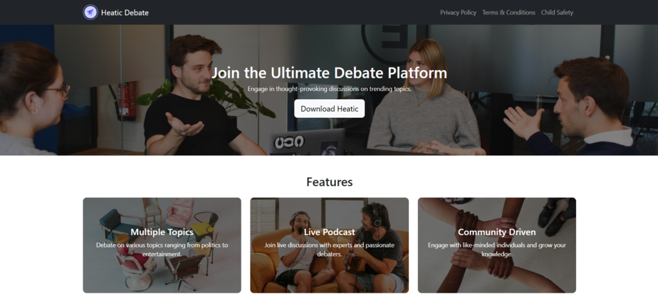

# 🗣️ Heatic Debate – Ultimate Live Debate Platform

Welcome to the official landing page for **Heatic Debate**, a dynamic and community-driven platform that encourages real-time, meaningful discussions on the world's most pressing and polarizing topics.


## 📲 Download the App

Experience Heatic on the go:

👉 [**Download on Google Play Store**](https://play.google.com/store/apps/details?id=com.asm.heatic)

---

## ✨ Features

🔹 **Multiple Topics** – Debate anything from politics to pop culture  
🔹 **Live Podcasts** – Join live sessions with experts and thought leaders  
🔹 **Community Driven** – Engage and grow with like-minded debaters  
🔹 **YouTube Integration** – Watch debates in real-time on our channel  
🔹 **Responsive Design** – Optimized for mobile, tablet, and desktop  

---

## 📸 Preview



---

## 🌐 Tech Stack

- **HTML5 / CSS3 / JavaScript**
- **Bootstrap 5.3**
- **EmailJS** – For handling contact forms
- **Responsive Design** – Mobile-first development

---

## 🚀 Getting Started

To run the project locally:

```bash
git clone https://github.com/Sakshi-2508/Heatic-Debate-Group-Dicsussions.git
cd heatic-debate
open index.html
